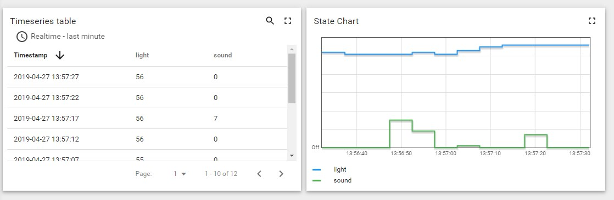

# Baby Monitor
Set up an Arduino to monitor light and sound readings from your baby's room to determine when they wake up.

## Arduino
Components I used:
- [Arduino Uno WiFi Rev2](https://store.arduino.cc/usa/arduino-uno-wifi-rev2)
- [OSEPP Light Sensor Module](https://www.osepp.com/electronic-modules/sensor-modules/69-light-sensor-module)
- [OSEPP Sound Sensor Module](https://www.osepp.com/electronic-modules/sensor-modules/78-sound-sensor-module)

## Analytics
Guide: [https://thingsboard.io/docs/user-guide/install/docker-windows/](https://thingsboard.io/docs/user-guide/install/docker-windows/)

### Setup
- [Prerequisites] Install Docker CE
- Create `d:\tb\` directory
- [Windows] Run `docker run -it -p 9090:9090 -p 1883:1883 -p 5683:5683/udp -v d:\tb\data:/data -v d:\tb\logs:/var/log/thingsboard --name mytb --restart always thingsboard/tb-cassandra`
- Browse to [http://localhost:9090](http://localhost:9090)

### Test
- [PowerShell] Run `Remove-item alias:curl`
- Run `curl -d "{""light"": 7, ""sound"": 13}" http://localhost:9090/api/v1/A1_TEST_TOKEN/telemetry --header "Content-Type:application/json"`